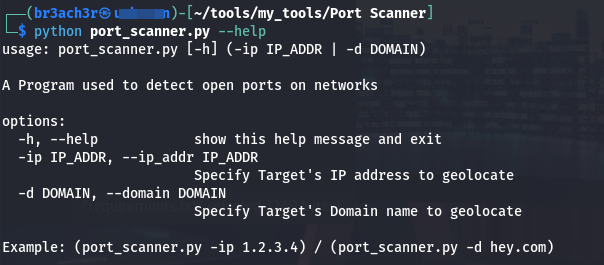

# Network Port Scanner
- A Program used to detect open ports on networks


## usage
- ```python3 portscanner.py -ip 1.2.3.4```
- ```python3 portscanner.py -d hey.com```



### options:
- ```-h, --help            		   Show this help message and exit```
- ```-ip, --ip_addr 	   		   Specify target ip (1.2.3.4)```
- ```-d, --domain 	       		   Specify target Domain name```

## Installation
- ```git clone https://github.com/Horlalaycon/Port_Scanner.git```
- ```cd Port_Scanner```
- ```pip install -r requirements```
- ```chmod +x portscanner```
- ```./portscanner.py -ip 1.2.3.4 or ./portscanner -d hey.com)```

# Author
- Program Developed by sys_br3ach3r @ GitHub https://github.com/Horlalaycon
